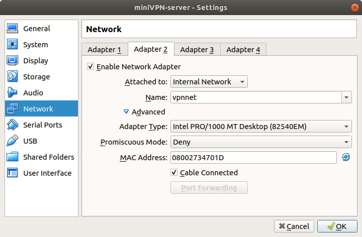
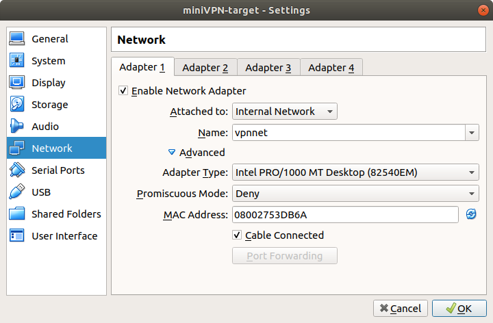
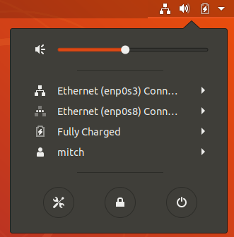
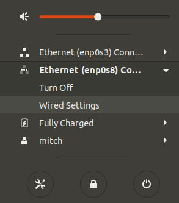
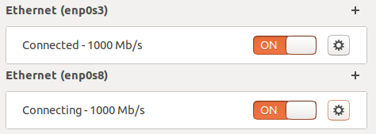
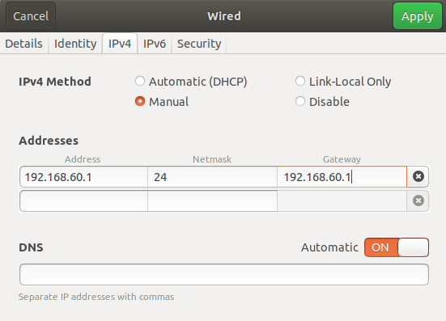
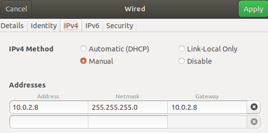
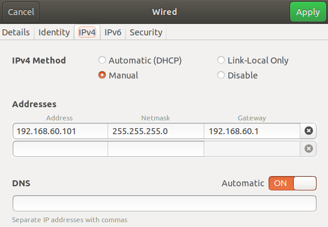
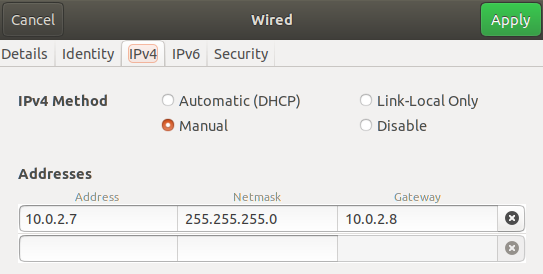
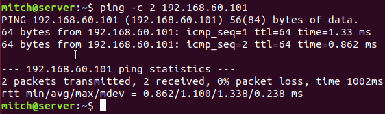

## miniVPN

This project is following SEEDLabs VPN-labs. To execute the lab, multiple virtual machines will need to be created. The table below shows the networking table that we try to achieve.

| machine | IP |
| ------- | -- |
| client | **10.0.2.7 (NAT)** |
| server | **10.0.2.8 (NAT)** & **192.168.60.1 (vpnnet)** |
| target | **192.168.60.101 (vpnnet)** |

The following software versions are utilized:
* hypervsior - Virtualbox 5.2.34_Ubuntu r133883
* guest OS - ubuntu-18.04.4-desktop-amd64

## VirtualBox settings

Do the following instructions through Virtualbox in order to set up the internal network between the server and the target

# 1. Server

* open up the settings of the **server** virtual machine

* click `Network` in the left column

* Open `Adapter 2` tab on the top (Leave Adapter 1 alone)

* Create an internal network by changing the `Attached to:` dropdown to `Internal Network`, and then give the network a name. We used vpnnet.

# 2. Target
* open up the settings of the **target** virtual machine

* click `Network` in the left column

* Open `Adapter 2` tab on the top (Leave Adapter 1 alone)

* Create an internal network by changing the `Attached to:` dropdown to `Internal Network`, and then give the network a name. We used vpnnet.

## Setting up networking in the virtual machine
# 1. Server
Log into your server machine and on the top right click the icon to open the dropdown menu.

You will notice that there are two 'ethernet' connections, and they will most likely be different names for you. We notice there that enp0s3 is up which is the NAT network, and enp0s8 is down which is the vpnnet network.

Click the `Wired Settings` option for the second ethernet option.

You will notice that two connections again , click the cog icon to the right of enp0s8 (the adapter name may be different for you)

Follow each step:
* click the `IPv4` tab on the top

* check off `Manual` in the IPv4 Method section instead of 'Automatic(DHCP)'

* Write the following networking settings shown below, and then click apply.

\

Now follow the same steps on the other network interface. In this case, the name was enp0s3.

# 2. Target
Similar to Server, set up the networking as such:

# 3. Client
Similar to Server, set up the networking as such:

# Testing setup

Test that the server can ping the target:
* press `ctrl + alt + t` to open a terminal
* type in `ping -c 2 192.168.60.101`

You should get a response

---
  
